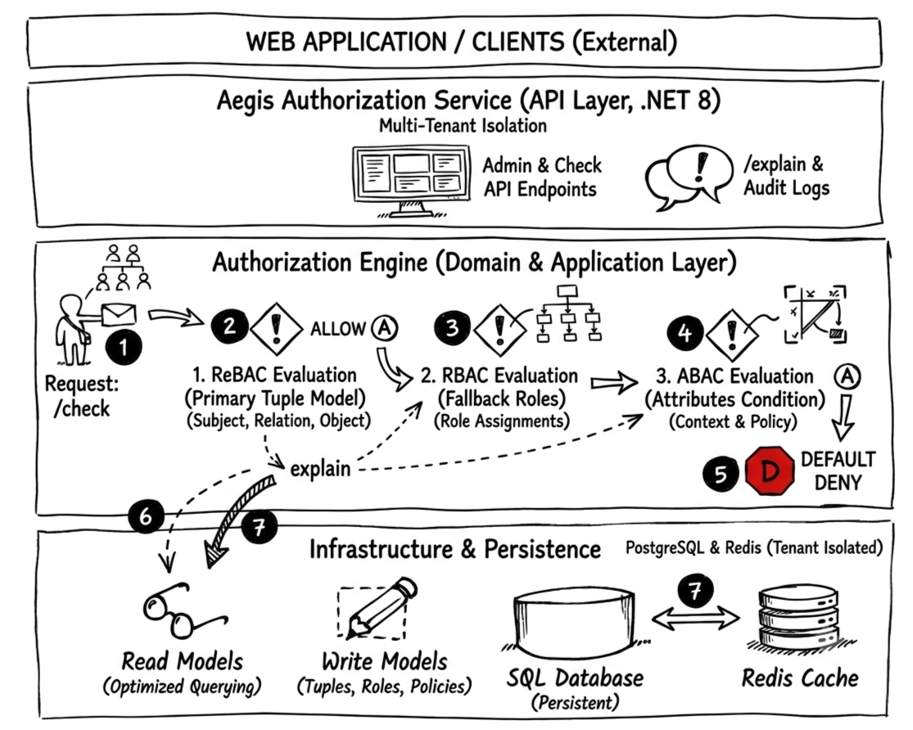

# Aegis

> Centralized, explainable authorization for products that need fine-grained access control.

[](https://dotnet.microsoft.com/)
[](https://learn.microsoft.com/aspnet/core)
[](https://www.postgresql.org/)
[](https://redis.io/)
[](https://react.dev/)
[](LICENSE)

Aegis is an authorization platform for applications that need clear, auditable, and explainable access decisions. It gives product teams a single place to model permissions, evaluate access, inspect relationship graphs, and understand why a request was allowed or denied.


*Figure 1: Aegis High-Level Architecture and Evaluation Pipeline.*

## What Aegis Solves

Authorization often starts simple: a role column, a few checks in controllers, and some UI-level guards. As a product grows, those checks spread across services, jobs, queries, and dashboards. The result is permission drift: teams cannot easily answer who has access, why they have it, or which rule produced a decision.

Aegis centralizes that work. Applications ask Aegis questions like:

```text
Can user:anne view document:roadmap?
Can user:agent1 view ticket:INC-1001?
Can user:finance inspect account:acme?
```

Aegis evaluates the request against authorization models, relationship tuples, roles, permissions, and optional context, then returns a deterministic decision with an explainable trace.

## Product Capabilities

- **Authorization stores** for isolating applications, tenants, environments, or domains.
- **Authorization models** for describing object types, relations, and inherited access.
- **Relationship tuples** for fine-grained access such as owners, editors, members, assignees, and viewers.
- **Runtime checks** for allow/deny decisions in product APIs.
- **Explain traces** for debugging support issues and security reviews.
- **Graph queries** to list users, list objects, and expand access paths.
- **RBAC administration** for roles, permissions, users, and assignments.
- **Audit records** for decision history and operational visibility.
- **OpenFGA-style compatibility endpoints** for familiar authorization integration patterns.
- **Admin dashboard** for managing stores, models, relationships, graph queries, access, and audit data.

## Example Domains

| Domain | Example question |
| --- | --- |
| Document collaboration | Can `user:anne` edit `document:roadmap`? |
| Support operations | Can `user:agent1` view `ticket:INC-1001`? |
| Billing consoles | Can `user:finance` view `account:acme`? |
| Internal platforms | Can `user:admin` manage a store's roles? |
| Analytics workspaces | Can `user:intern` view `dashboard:quality`? |

## How Aegis Thinks About Access

Aegis models access as a graph:

```text
subject -> relation -> object
```

Examples:

```text
user:anne editor document:roadmap
team:platform member user:bob
user:agent1 assignee ticket:INC-1001
```

An authorization model defines how those relationships should be interpreted. A check asks whether a subject has a relation to an object. Explain shows the path that led to the result.

## Documentation

Start here:

- [Documentation Home](docs/README.md)
- [Product Overview](docs/product/product-overview.md)
- [Core Concepts](docs/concepts/README.md)
- [User Guide](docs/guides/user-guide.md)
- [Dashboard Guide](docs/guides/dashboard-guide.md)
- [API Integration Guide](docs/guides/api-integration.md)
- [API Reference](docs/reference/api-reference.md)
- [Demo Data Guide](docs/reference/demo-data.md)
- [Deployment Guide](docs/operations/deployment.md)
- [Roadmap](docs/product/roadmap.md)

## Project Status

Aegis is under active development. The backend API, development seed data, and admin dashboard are usable for local development, demos, and integration experiments. The roadmap focuses on model lifecycle, assertion testing, relationship revisions, service accounts, API keys, audit improvements, webhooks, quotas, and observability.

## License

Aegis is released under the [MIT License](LICENSE).

