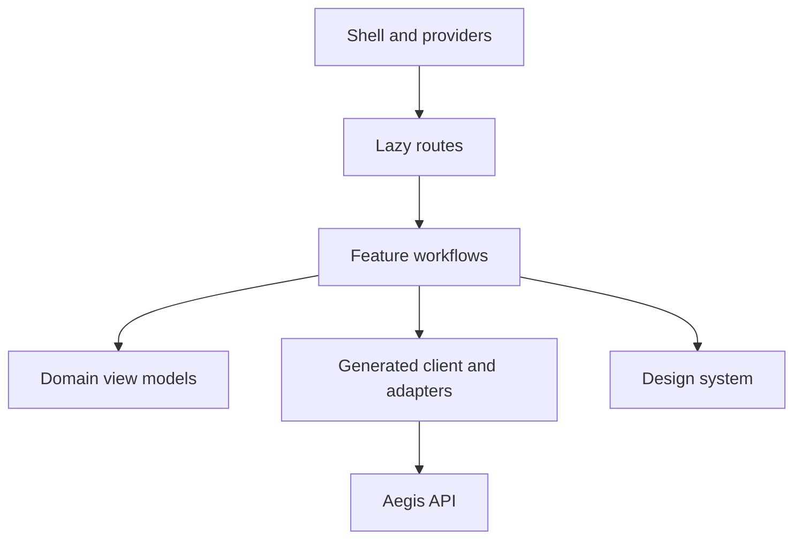

# Frontend console architecture

The Aegis console is a specialized workbench for modeling, testing, explaining, and operating authorization. It favors clear task boundaries and trustworthy feedback over generic dashboard patterns.

## Product and navigation model

The primary context is `tenant → store → active model`; routes and query keys preserve it. Navigation follows jobs: overview, model and assertions, relationships, check/explain and graph, activity, then access/settings. Presets become contextual actions rather than a top-level inventory.

The console is never an authorization authority. Hiding a control improves usability but does not enforce access. The backend validates every protected action, while the UI makes forbidden or partially privileged states explicit.

## Design language

Forge contributes one efficient tool workspace, actionable validation, keyboard access, recovery, and a cohesive quality gate. Lens of Charlie contributes quiet hierarchy, neutral palettes, semantic tokens, deliberate typography, bounded widths, responsive integrity, visible focus, and restrained motion.

Aegis adds operational density, decision status, table scanning, editing, diffs, and trace/graph inspection. Color communicates decision or risk, not decoration. Avoid gradients, glass effects, hidden hover-only actions, and walls of interchangeable cards.

## Layer model

The shell owns routing, session bootstrap, scope, theme, query configuration, and global error handling. Features own workflows. The generated client transports contracts without UI behavior. The design system owns interaction and visual contracts without business rules.

## Data ownership

| State           | Owner                     | Example                                      |
| --------------- | ------------------------- | -------------------------------------------- |
| Server          | TanStack Query            | stores, models, relationships, audit         |
| Shareable       | URL                       | store, filters, model version, trace ID, tab |
| Transient       | Component                 | dialog, focus, unsaved field                 |
| Safe preference | Local persistence         | theme, density, collapsed navigation         |
| Session secret  | Secure identity mechanism | never ordinary localStorage                  |

Runtime schemas validate network/editor input. Feature adapters map generated transport types into view models. Query invalidation includes tenant/store/version; a generic relationship invalidation across tenants is invalid.

## Route contract and recovery

Each route specifies initial loading, refetch, empty state, retryable error, forbidden, session expiry, stale/offline state, mutation progress, partial failure, conflict recovery, and destructive confirmation. Toasts supplement durable page evidence. Complex workbenches split request editing, validation, execution state, summary, explain tree, raw output, and history into testable units.

## Accessibility and responsiveness

Target WCAG 2.2 AA with semantic landmarks, visible focus, accessible names, predictable tab order, reduced motion, forced colors, zoom, and screen-reader review. Monaco and graphs need keyboard paths and non-visual equivalents. Narrow layouts may stack or tab panes but cannot hide essential actions or evidence. Tables scroll or transform explicitly rather than dropping columns silently.

## Contracts, security, and tests

Generate transport code from release-candidate OpenAPI and fail CI on schema drift. Render model/trace content as untrusted, remain CSP-compatible, redact client telemetry, and never send policy or tuple context to third parties without approval.

Test utilities and mappings, components and state transitions, API fixtures/contracts, visual/accessibility states, then end-to-end login, scope switching, model publication/rollback, relationship mutations, check/explain, audit correlation, conflict, and session expiry.

## Migration

The old dashboard stays as a behavioral reference. A parity ledger tracks routes and approved exceptions. Deliver read-only slices, authoring, the decision workbench, then administration. Cut over after contract, accessibility, performance, support, and parity gates pass; remove legacy only after a rollback window.

## Completion checklist

- [ ] Scope is explicit in routes, queries, mutations, and cache keys.
- [ ] New features do not import legacy internals.
- [ ] Generated contracts are the HTTP shape source.
- [ ] Loading, empty, error, forbidden, stale, conflict, and destructive states are tested.
- [ ] Critical flows pass keyboard, screen-reader, responsive, visual, and end-to-end checks.
- [ ] Client telemetry excludes secrets and sensitive authorization content.

## Continue reading

See the [frontend rewrite plan](../../temp/frontend-rewrite-plan.md) for delivery phases and [System architecture](./system-architecture.md) for backend boundaries.
