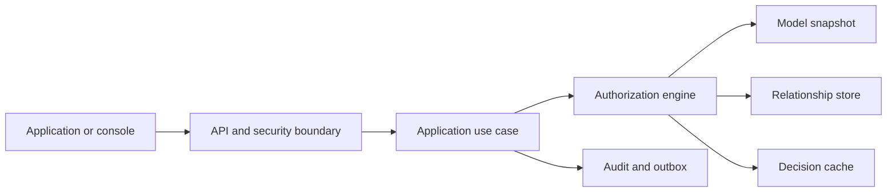

# Aegis system architecture

Aegis centralizes fine-grained authorization decisions while leaving authentication and business data in their owning systems. This article explains how the codebase is divided, where security boundaries belong, and how a request becomes an auditable decision.

## Mental model

Treat Aegis as a policy decision point. An application asks a narrowly framed question using a subject, relation, object, store, and optional context. Aegis resolves an immutable model snapshot and relevant relationships, evaluates the request under bounded rules, and returns a decision plus trace identifiers. The application remains the enforcement point.

HTTP details stop at the API boundary; orchestration belongs to Application; authorization semantics belong to Authorization and Domain; storage and publishing details belong to Infrastructure.

## Repository boundaries

| Project                | Responsibility                                                      | Must not own                                 |
| ---------------------- | ------------------------------------------------------------------- | -------------------------------------------- |
| `Aegis.Api`            | Host, HTTP, authentication, policies, middleware, health            | Authorization algorithms or database queries |
| `Aegis.Application`    | Use cases, validation sequence, transaction intent, mapping         | Transport or vendor-specific persistence     |
| `Aegis.Authorization`  | Evaluation, rewrites, cache abstractions, traces                    | HTTP identity or PostgreSQL details          |
| `Aegis.Domain`         | Aggregates, value objects, invariants, events, repository contracts | Serialization or infrastructure behavior     |
| `Aegis.Contracts`      | Stable request and response shapes                                  | Business rules                               |
| `Aegis.Infrastructure` | PostgreSQL, Redis, sessions, outbox, adapters                       | Product policy decisions                     |
| `Aegis.SharedKernel`   | Small cross-layer primitives                                        | Feature-specific convenience code            |

These boundaries keep authorization testable without a web server or database and reduce the chance that a vendor change alters decision semantics.

## Request lifecycle

### Establish identity and scope

The API applies limits and correlation, validates the token, and derives actor and tenant claims. Authentication does not prove access to the requested tenant or store. Tenant policy compares trusted identity scope with route/body scope before application work begins.

### Validate and resolve a snapshot

Transport validation checks shape and size; domain validation checks identifiers and invariants; model validation checks type, relation, rewrite, and condition semantics. The engine resolves one immutable model version for the full decision. Its identifier belongs in cache identity, audit evidence, and explain output.

### Evaluate within budgets

The engine evaluates deny policy, direct relationships, rewrites, contextual conditions, and supported RBAC fallback in a documented order. Depth, breadth, tuple count, deadline, and cancellation bound work. Exhausting a safety budget never becomes an implicit allow.

### Record evidence

Metrics describe aggregate behavior with bounded cardinality. Logs and traces correlate a request without exposing tokens or sensitive tuple context. Audit records contain actor, scope, action, outcome, model version, and approved reason data.

## Write lifecycle and consistency

Model and relationship mutations affect future decisions and cached results. A safe path validates input, commits authoritative state plus audit/outbox data in one transaction, then publishes idempotent invalidation events. Cache entries include tenant, store, model version, and decision identity.

Aegis must explicitly choose its read-after-write contract. Strict visibility means a successful mutation is observable by subsequent checks. Bounded eventual consistency requires the response and console to disclose pending visibility.

## Failure behavior

- Invalid identity, tenant mismatch, or missing model fails closed.
- PostgreSQL loss makes authoritative work unavailable rather than promoting stale data.
- Redis loss may reduce performance but cannot change the correct answer.
- Outbox publishing failure retains committed messages and exposes backlog health.
- Deadline or graph-budget exhaustion returns a stable result/error with trace evidence.

## Architecture verification

- [ ] Dependency tests enforce project boundaries.
- [ ] Every decision retains one tenant, store, and model version.
- [ ] Repository and cache isolation tests include cross-tenant negatives.
- [ ] Golden scenarios run without infrastructure dependencies.
- [ ] Integration tests prove transactions, invalidation, retries, and cancellation.
- [ ] Telemetry diagnoses degradation without leaking policy data.

## Continue reading

Read [Deterministic authorization decisions](../concepts/deterministic-authorization.md), [Tenant and store isolation](../concepts/tenant-store-isolation.md), then [Operating Aegis in production](../operations/production-readiness.md).
